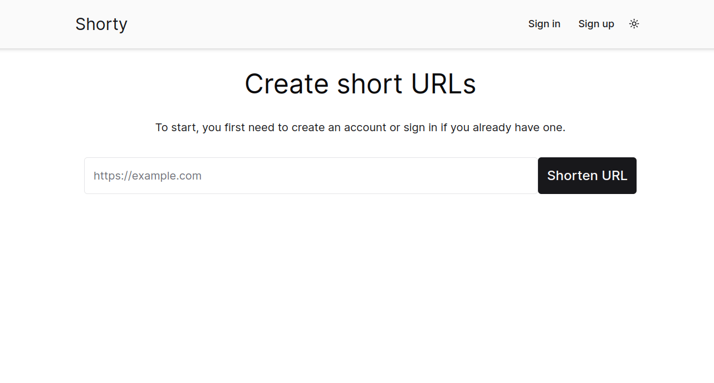
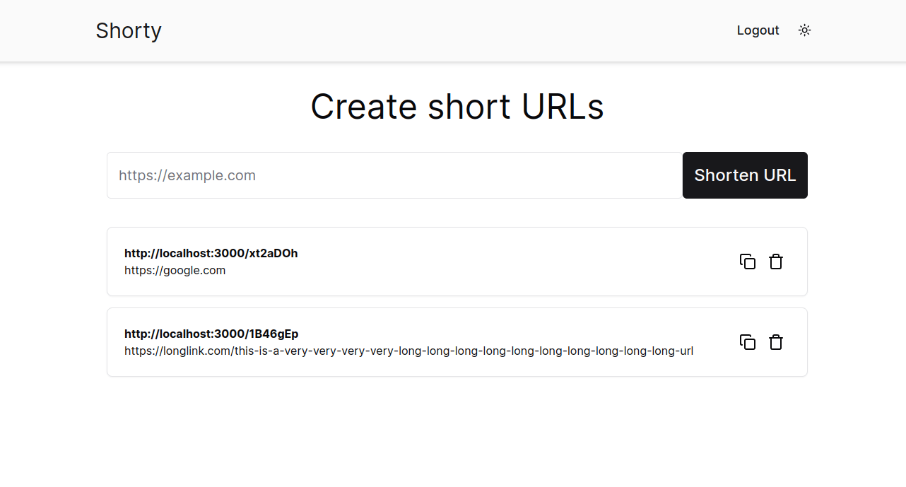

## Introduction

Url shortener web page

### Screenshots




## Getting Started

Create .env.local file based on .env.example

```bash
$ cp .env.example .env.local
```

Install dependencies

```bash
$ npm install
```

Run the development server:

```bash
npm run dev
# or
yarn dev
# or
pnpm dev
# or
bun dev
```

Open [http://localhost:3000](http://localhost:3000) with your browser to see the result.
